# Azure SAP Integration Lab

## Prerequisites

- Microsoft Azure subscription
- Resource Group to deploy Azure services
- Permissions to create the following resource  
    - Data Gateway Installed on Customer's On Prem with the correct .NET libraries
    - Logic App

## General steps to integrate and call any SAP remote function call

1. SAP connector/adaptor is the gateway to the target SAP system. So before we make any SAP RFC call we need to pass in the correct request and response objects.

   I.E. We need to confirm to a spec and provided the exact XML otherwise the adaptor will reject it and not send it over to the target SAP instance
   
2. It is the job of the SAP adaptor(driver) to know these objects and it will tell you the meta data (external schema definition:- XSD) if you ask him to describe it.
3. This describe feature can be called when you specifically call **Generate Schemas** action in the adaptor which is exposed as an API, just like **Send BAPI message **
4. You will need to pass in the SAP RFC action name
5. By default, the SAP adaptor will return the root elements for request/response objects and followed by the child elements in two objects which is mbedded inside an array.
   Also the data stream is encoded.
7. If you are going to do exercise many integrations, this is going to be a manual nightmare.
8. I decided to automate this and help the community so I am going to ask you to create a separate Logic App to extract these xsd's first. Think about this Logic App as a cookie    cutter to do many integrations in the SAP world.
9. I will automate this completely when I get time.

## Step 1: Create a Logic App that can describe input/output objects (request/response) to run any SAP RFC action
1. In the Azure Portal, search for **Logic App**
2. Click on the **Add** button
3. Fill out the **Basics** tab as follows:
- **Subscription:** Choose your subscription
- **Resource group:** Provide a unique name like **ata-webapp-username-rg**
- **Region:** EastUS

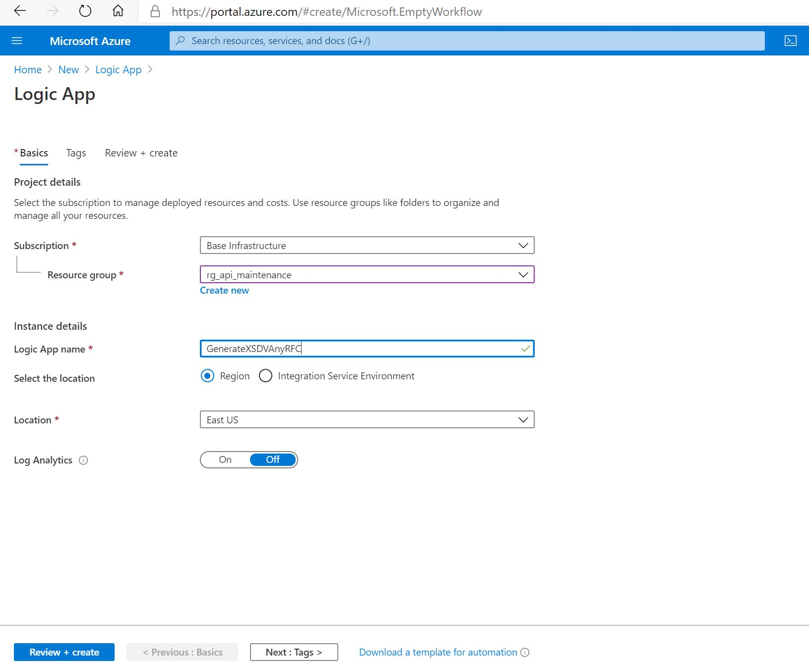  

4. Click the **Next: Review + Create** button
5. Click the **Create** button

## Step 2: Add workflow steps into your Logic App
1. Take meta data code from the repository and then copy-paste and save
2. When you save you will need to create a connection to your SAP instance if you have not done so
3. Go back to the designer and make sure you see the following steps

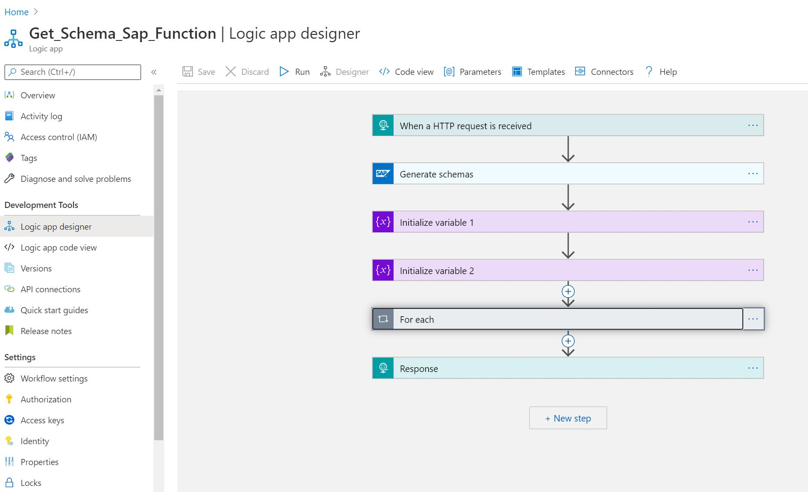

4. You are now in a state to run this logic app and describe any RFC action's request/response objects 

## Step 3: Let's try and describe a simple SAP action

1. Go to POSTMAN, add correct JSON Content-Type and in the payload add the sapaction action attribute
2. Please make sure you fill rest of the fields. The URI is available from the HttpTrigger step of the Logic App
3. Here is my POSTMAN screen shot as input

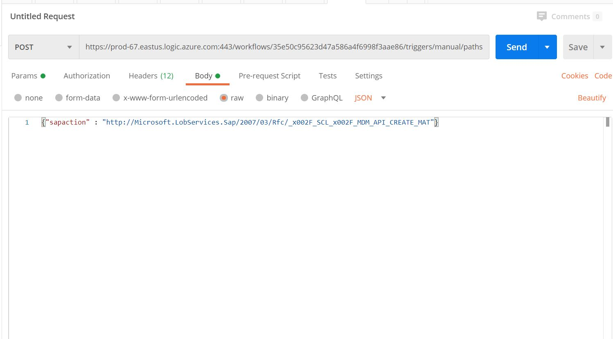

4. Click the **Send** button
5. You should see schema definitions coming back as response from this Logic APp.
6. I have added -------- as a delimiter between the RFC xsd and the TYPES xsd. So you will need to extract them as separate files on your local system
7. Also the RFC xsd file does an import of the TYPES xsd, so make sure the name is entered correctly to tie both of them. Otherwise, it will say 'undefined import'
7. Here is my POSTMAN screen shot as output

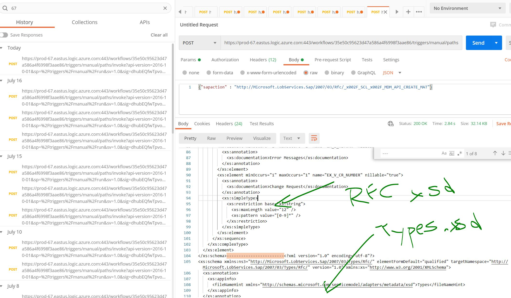

5. Collect the sample xsd's from the response tab of the Postman. This is an important step. Make sure you get a 200 OK and the XSD data

## Step 4: Now that we have the two XSD's, let us create a xml payload

1. Please use any tool like XMLSpy or Liquid Studio
2. Load the two files in your studio and make sure the references betyween each other is satisfiled.
3. Make sure you select the root entry of the XML correctly.
4. Here is my screen shot using the two xsd's. I have selected the  SCL_MDM_API_CREATE_MAT as the root

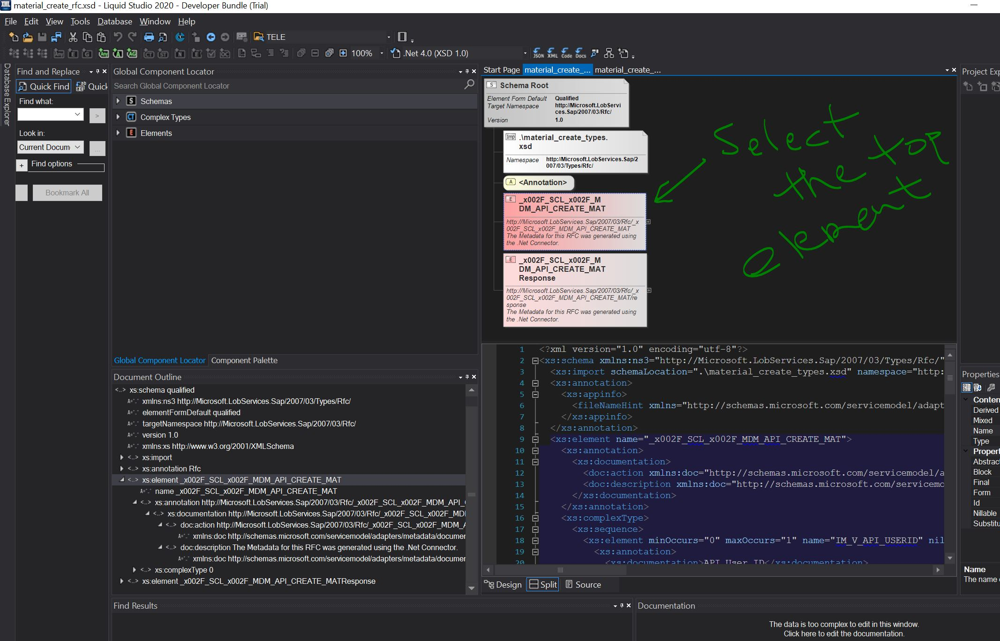

5. Then I click on the Tool option.
7. Here is my screen shot 

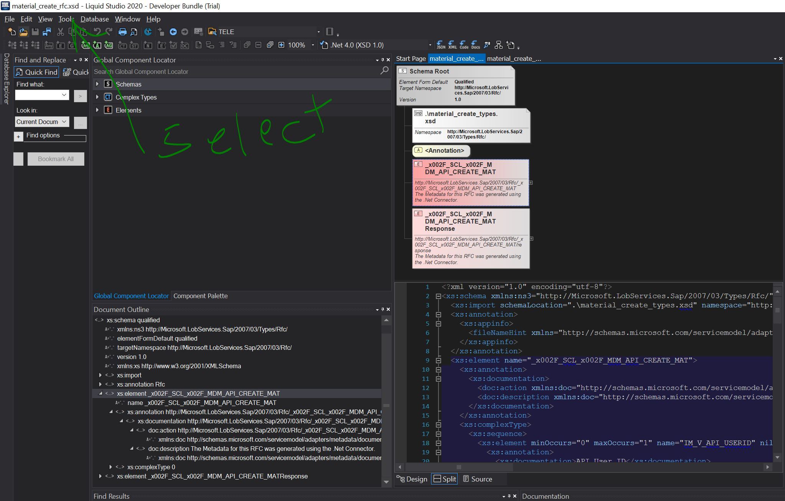

8. Then click on 'Generate Sample XML from the XSD' option
9. Here is my screen shot

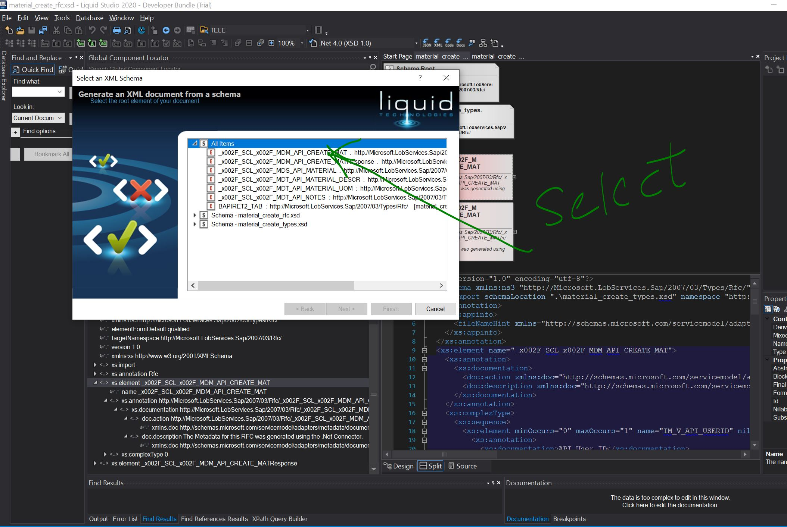

10. Then click 'Finish'

This will generate sample XML that can be used as a payload

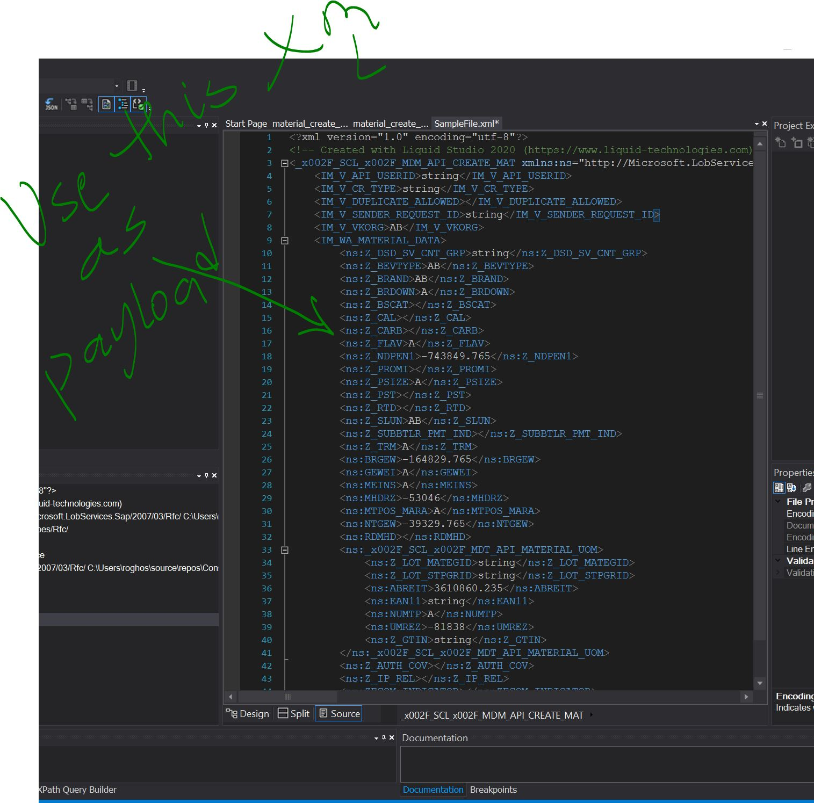

## Step 5: Create a actual Logic App that can execute and exercise the entire Integration Flow into your SAP system.

1. Go back to your list of Logic Apps and then create a new Logic App that will actually be calling the SAP RFC Function.
    We do have the sample payload from the earlier steps.

2. It is ok to create this Logic App as an Http Trigger

3. You can maybe have a step an extra step to convert from JSON to XML as the first step.

4. Then add the important step. Choose SAP action as 'SAP Send Message'. When it prompts for action, force yourself and add SAP action not via drop-downs but by forcing and typing in the same
action that you wanted the SAP connector to describe.

5. In our case it is 'http://Microsoft.LobServices.Sap/2007/03/Rfc/_x002F_SCL_x002F_MDM_API_CREATE_MAT'

6. When it prompts for input, you can enter the entire xml payload from before

7. Add another step to use Http Response and add the response from the SAP Send message step as input to be returned to the caller.
   Return body response is what you want to see return.

8. Verify it works and you should get passed validation.

9. Make sure you are able to see the message on the SAP system to confirm.

10.We should see **Material object: Added**

  CONGRATULATIONS. Great job you have finished the LAB successfully!

## Step 5: Problems seen from our CONA integration

Some of the custom RFC methods implemented by CONA shows one to many relationships on their side.
Our SAP adapter describe does not catch the cardinality ( ONE TO MANY). In this situation, our XSD does not show ArrayOf <BAPI list Objects>
    

**_x002F_SCL_x002F_BAPI_SORD_CREATEFROMDAT2 ** has worked **

1. The XSD's does have a ArrayOf BAPISITDM

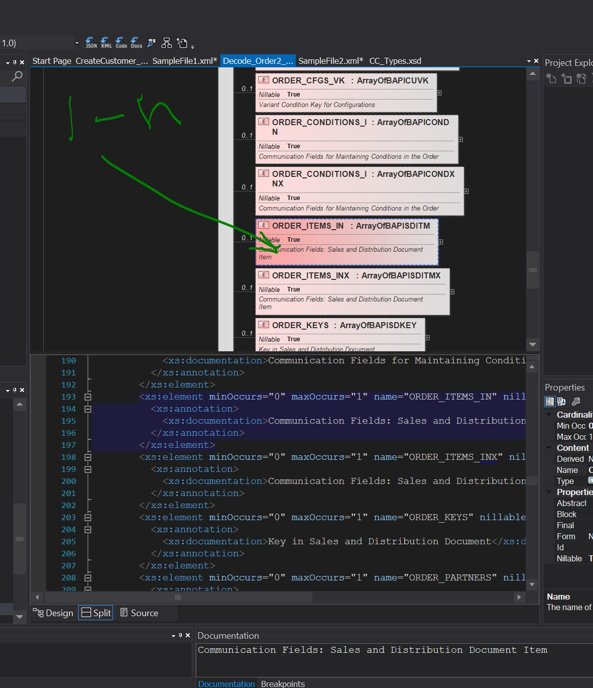

2. The XML we presented to the system has worked

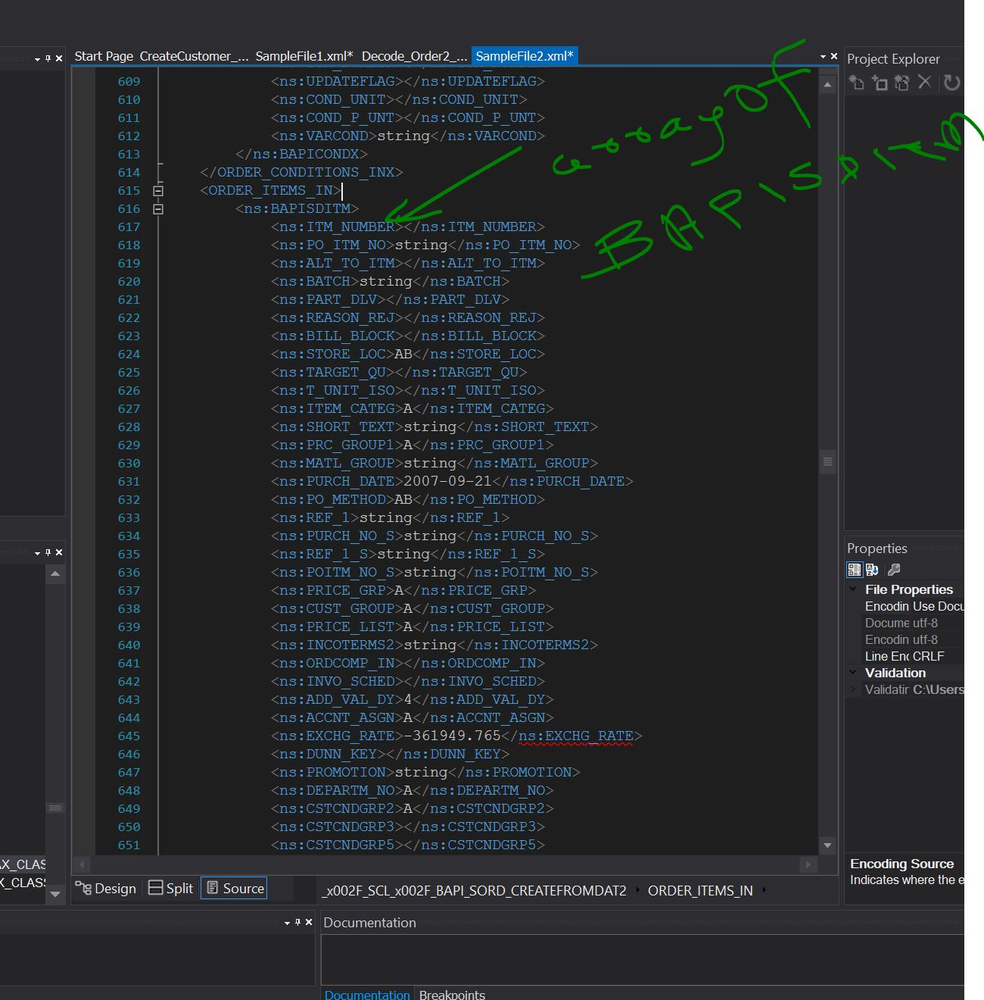

Apps and then create a new Logic App that will actually be calling the SAP RFC Function.
    We do have the sample payload from the earlier steps.

2. It 

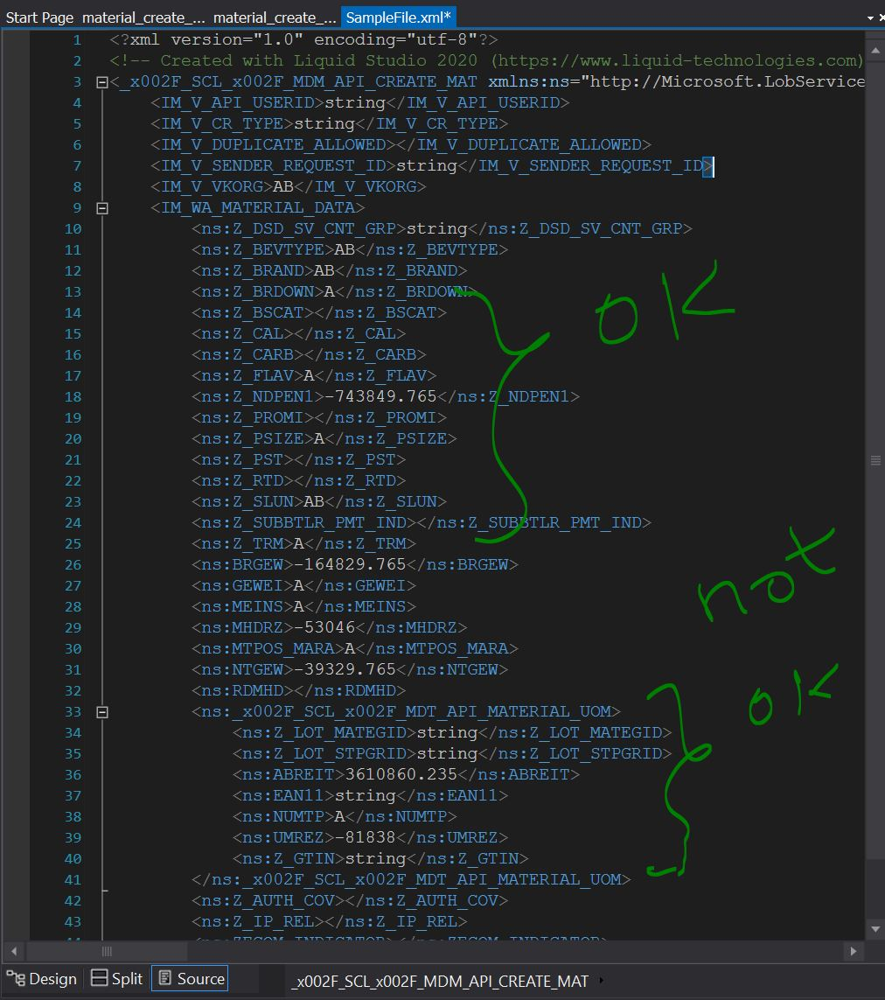

